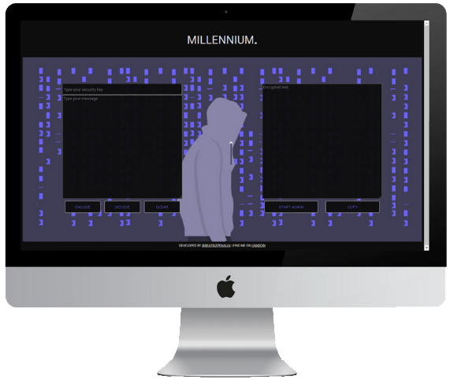
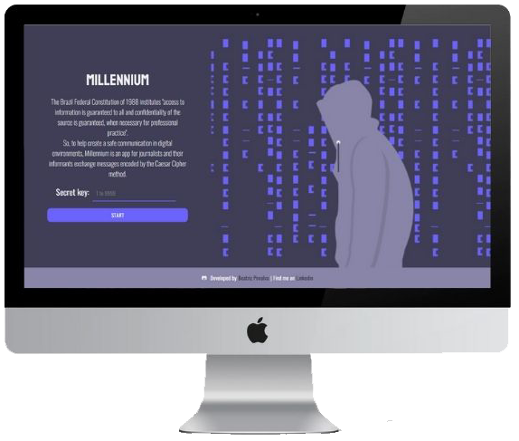
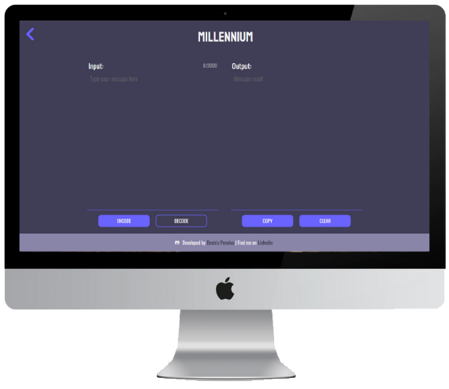
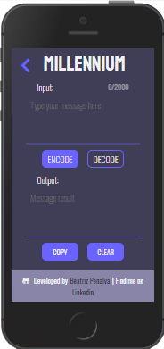

<h1 align="center" id="millennium"> 📬 Millennium </h1>

<p align="center">
  ⚡ An app for journalists and their informants exchange messages encrypted by the Caesar Cipher method. To access click <a href='https://beatrizpenalva.github.io/millennium/'>here</a>! ⚡ 
</p>

<p align="center">
 <a href="#-challenge">Challenge</a> •
 <a href="#-about">About</a> •
 <a href="#-development">Development</a> • 
 <a href="#-getting-started">Getting Started</a> • 
 <a href="#-build-with">Build With</a> • 
 <a href="#-author">Author</a>
</p>

---

## 🎯 Challenge

The proposal was to develop an app to encode and decode messages using the Ceaser Cipher method in two weeks, using only vanilla JavaScript, HTML5 and CSS3. The first project developed in [Laboratoria](https://www.laboratoria.la/) Bootcamp.

<p align="center">
  </img>
</p>

<p align="right">
  <a href="#millennium"> Back to the top. </a>
</p>

---

## 📧 About

The Brazil Federal [Constitution](http://www.planalto.gov.br/ccivil_03/constituicao/constituicao.htm) of 1988 in its Art. 5th, item XIV, institutes "access to information is guaranteed to all and confidentiality of the source is guaranteed, when necessary for professional practice". However, recent episodes of national policy exposed the fragility of the youth Brazilian democracy in several aspects, including the confidentiality of the source, such as the attempt to coerce the delivery of sources in the case of the press editorial [Vaza Jato](https://theintercept.com/series/mensagens-lava-jato/). 
 
So, a group of Brazilian Journalists hired the famous Scottish investigative journalist Mikael Blomkvist, co-founder and chief editor at [Millennium](https://pt.wikipedia.org/wiki/S%C3%A9rie_Millennium) magazine, to develop a solution that helps to create safe communication in digital environments between journalists and their informants. 

<p align="right">
  <a href="#millennium"> Back to the top. </a>
</p>

---

## 💡 Development
 
### ⚙️ Features

To encode a message the user needs to:
 - [x] Type the secret number
 - [x] Type the message
   - [x] Caracteres accepted: spaces, numbers, special characters, capital and small letters
- [x] Choose between encode or decode method
 
Other  features:
 - [x] The user can copy the message encrypted by clicking in one button
 - [x] The user can reset the message to encrypt by clicking in one button

You can see the app working in its old layout version:

<p align="center">
    </img>
</p>

<p align="right">
  <a href="#millennium"> Back to the top. </a>
</p>

### 🎨 User interface

The User Interface's aesthetic was inspired by the true protagonist of the Millennium trilogy, the hacker Wasp, also known as Lisbeth Salander. Therefore, the color palette was based on Salander's style and the background image, designed by [Katerina Limpitsouni]((https://undraw.co/)), was chosen to make reference to her profession. To check if the colors used have good contrast for people with daltonism, the color palette was tested using the [Adobe Accessibility Tool](https://color.adobe.com/pt/create/color-accessibility).
 
#### Background

<p align="center">
    </img>
</p>

#### Color palette

<p align="center">
    </img>
</p>

<p align="center">
    </img>
</p>

#### Typography

It was used two family fonts in the app, [Staatliches](https://fonts.google.com/specimen/Staatliches?query=Staatliches) for the logo and [Oswald](https://fonts.google.com/specimen/Oswald?query=oswald) for the titles, subtitles and texts. 

<p align="center">
    </img>
</p>

### ✍ Prototype

The app development started from a sketch that prioritized the input and output message, but after the app implementation and usability tests, it was mapped some improvements, including the need for a responsivity design. 

#### Low fidelity

<p align="center">
    </img>
    <br>
    🔎 Click on the image to enlarge 
</p>

#### First interface version

<p align="center">
    </img>
    <br>
    🔎 Click on the image to enlarge
</p>

#### Desktop interface

<p align="center">
    </img>
    <br>
    🔎 Click on the image to enlarge 
</p>

<p align="center">
    </img>
    <br>
    🔎 Click on the image to enlarge 
</p>

#### Mobile interface

<p align="center">
    </img>
    <br>
    </img>
    <br>
    🔎 Click on the image to enlarge 
    <br>
</p>

### 🕵️‍♀️ Usability test 

The User Experience was focused on being an intuitive and practical tool, in that way, the user will spend the minimum time using the product. But to improve the app usability it was necessary to apply tests and the feedback was:

&nbsp;
⚠️ There is not an explication about the app.

&nbsp;
✔️ It was developed a home page with a little explanation about the app.

&nbsp;
⚠️ It is not possible to know how many characters the message can have.

&nbsp;
✔️ There is a character counter next to the input.

&nbsp;
⚠️ It is difficult to read what is written on the buttons.

&nbsp;
✔️ The color palette and design system were improved to guarantee the contrast of the colors and also the font size was raised.

&nbsp;
⚠️ After press the _start again button_, the app brokes.

&nbsp;
✔️ Only the clear button remains since the star again did not provide a better user experience.

&nbsp;
⚠️ Starts with one encrypt method already checked.

&nbsp;
✔️ It changed the buttons _encode_ and _decode_ for inputs type radio, so when the user access the cipher page the method encode is already checked.

&nbsp;
⚠️ It does not have feedback if the _copy button_ really worked.

&nbsp;
✔️ After the user clicks on the _copy button_, the inner text changes to _copied_ for a few seconds.

&nbsp;
⚠️ The user can write on the output text area.

&nbsp;
✔️ The output text area changed to _read-only_.

&nbsp;
⚠️ After starting type it is not possible to know what kind of information it is necessary to write in the input.

&nbsp;
✔️ It was implemented the label of all inputs.

### 🚧Future implementations

&nbsp;
📌 Make it clear that the secret key is mandatory

&nbsp;
📌 Allow the user to see the secret key on the cipher page

&nbsp;
📌 Confirm if the user really want to reset the inputs

&nbsp;
📌 Make it clear that the user can choose between _encode_ and _decode_ 

&nbsp;
📌 Let the _copy_ and _clear_ buttons disabled while there is not a message to encrypt

<p align="right">
  <a href="#millennium"> Back to the top. </a>
</p>

---

## 🚀 Getting Started 

📂 The file is structured as follows:

```text
./
├── .babelrc
├── .editorconfig
├── .eslintrc
├── .gitignore
├── README.md
├── package.json
├── package-lock.json
├── src
│   ├── index.js
│   ├── main.js
│   ├── cipher.js
│   ├── index.html
│   ├── cipher.html
│   ├── style.css
│   └── img
└── test
    ├── .eslintrc
    └── cipher.spec.js
```

🧭 Before running the app, you need to have installed these tools on your computer: [Git](https://git-scm.com) and [Node.js](https://nodejs.org/en/).

```bash

# Fork the repository

# To clone this repository on your computer run:
$ git clone https://github.com/beatrizpenalva/millennium.git

# To install the dependencies in your project's directory run:
$ npm install

# To execute the app on development  mode run:
$ npm run start

# The app will be open on port:5000 - access http://localhost:5000

# To execute the coding style tests run:
$ npm run pretest

# To execute unit tests run:
$ npm run test

# To deploy on GitHub-Pages run:
$ npm run deploy

```

👊 To contribute to this project:

```bash

# After installing the repository on your computer, create a new branch with your updates:
$ git checkout -b my-feature

# Save your changes
$ git add .

# Create a commit message telling what you did: 
$ git commit -m "feature: My new feature"

# Send your contribution to this repository
$ git push origin my-feature

```

<p align="right">
  <a href="#millennium"> Back to the top. </a>
</p>

---

## 👩‍💻 Build With

&nbsp;
🛠 JavaScript (ES6)

&nbsp;
🛠 HTML5

&nbsp;
🛠 CSS3

<p align="right">
  <a href="#millennium"> Back to the top. </a>
</p>

---

## 🦸 Author

&nbsp;
Developed with ❤️ by [Beatriz Penalva](https://github.com/beatrizpenalva) | Find me on [Linkedin](https://www.linkedin.com/in/beatrizpenalva/) 👋

<p align="right">
  <a href="#millennium"> Back to the top. </a>
</p>
