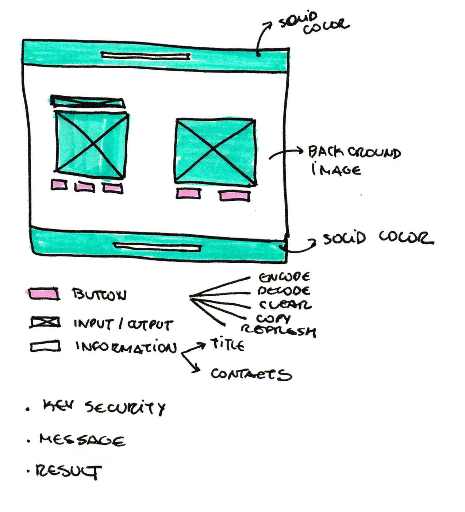

# Millennium

    </img>

  🌟 An app for journalists and their informants exchange messages encoded by the Caesar Cipher method . To access click <a href='https://beatrizpenalva.github.io/millennium/'>here</a>! 🌟 

 <a href="#challenge">Challenge</a> •
 <a href="#about">About</a> •
 <a href="#user-experience">User Experience</a> • 
 <a href="#user-interface">User Interface</a> • 
 <a href="#acknowledgments-and-credits">Acknowledgments and credits</a> • 
 <a href="#author">Author</a>

---

***

## 🎯 Challenge

## About

The Brazil Federal [Constitution](http://www.planalto.gov.br/ccivil_03/constituicao/constituicao.htm) of 1988 in its Art. 5th, item XIV, institutes "access to information is guaranteed to all and confidentiality of the source is guaranteed, when necessary for professional practice". 

However, recent episodes of national policy exposed the fragility of the youth Brazilian democracy in several aspects, including the confidentiality of the source, such as the attempt to coerce the delivery of sources in the case of the press editorial Vaza Jato. 
 
So, a group of Brazilian Journalists hired the famous Scottish investigative journalist Mikael Blomkvist, co-founder and chief-editor at Millennium magazine, to develop a solution that helps to create safe communication in digital environments between journalists and their informants. 

---

## 💻 Development

### 💡 User Experience

The User Experience was focused on being an intuitive and practical tool, in that way, the user will spend the minimum time using the product. 
How to use the app step by step:
 
 ### ⚙️ Features
* Create or type your security key
* Type the message
* Click the button  to encode or to decode (as long the message was coded by the Caesar Cipher method it will work) 
* Click the button to copy the message coded and do not forget to send the security key to your interlocutor
* If you type anything wrong you can click on ‘clean’
* If you want to start to code or decode a new message click on ‘start again’

###🔎 Testing
✍️👉🚀

### 🎨 Product

The User Interface's aesthetic was inspired by the true protagonist of the Millennium trilogy, the hacker Wasp, also known as Lisbeth Salander. Therefore, the color palette was based on Salander's style and the background image in her profession.

### 🧪 Testing

Laboratoria teste

### 🚧Future implementations
📌 Responsividade
📌 Acessibilidade
📌 Sobre
📌 Hacker edition

---

## 🛠 Build With

&nbsp;
📌 JavaScript (ES6)

&nbsp;
📌 HTML5

&nbsp;
📌 CSS3

---

## 👩‍💻 Acknowledgments and credits

&nbsp;
Icons

&nbsp;
Typography

&nbsp;
Background Image by Katerina Limpitsouni - [unDraw](https://undraw.co/)

&nbsp;
Project developed in [Laboratoria](https://www.laboratoria.la/) Bootcamp 💛

---

## 🦸 Author

&nbsp;
Developed with ❤️ by [Beatriz Penalva](https://github.com/beatrizpenalva) 👋
